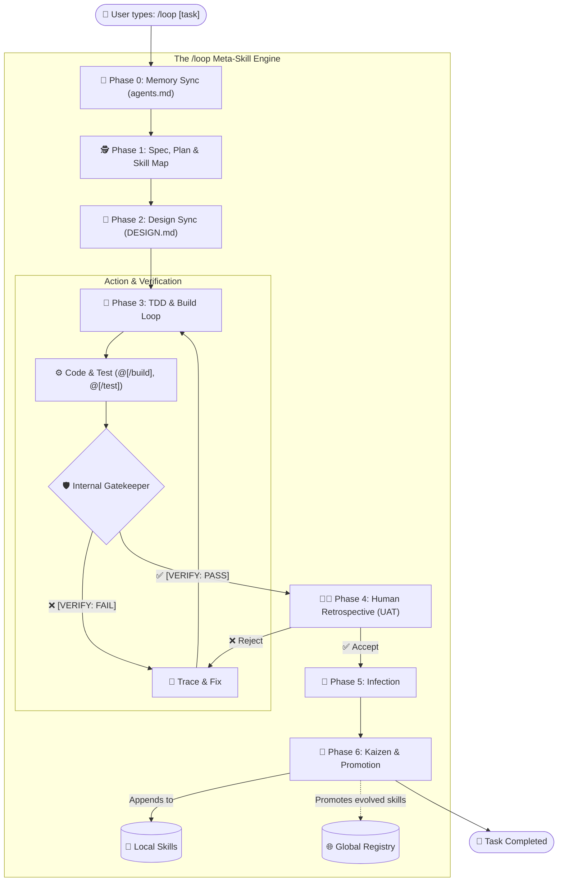

# /loop: The Self-Improving Meta-Skill for AI Agents

[](https://github.com/alimzhankhalelov/awesome-evolving-skills/releases)
[](https://github.com/anthropics/skills/blob/main/skills/skill-creator/SKILL.md)
[](https://github.com/alimzhankhalelov/awesome-evolving-skills)

> **Stop rewriting prompts. Let your agent rewrite them for you.**

`/loop` is a lightweight, zero-framework meta-skill for AI agents in modern IDEs. It transforms your static prompts into self-improving, autonomous workflows using just Markdown. No Python scripts, no heavy frameworks—just a single `.md` file that teaches your agent how to learn from its own mistakes.

---

## Quick Start

### Installation

The `/loop` skill is a pure markdown file, making it universally adaptable.

<details>
<summary><strong>1. Hermes Agent</strong></summary>

```bash
mkdir -p ~/.hermes/skills
curl -o ~/.hermes/skills/loop.md https://raw.githubusercontent.com/alimzhankhalelov/awesome-evolving-skills/master/loop/SKILL.md
```
</details>

<details>
<summary><strong>2. Cursor & Kilo Code</strong></summary>

```bash
mkdir -p .cursor/rules
curl -o .cursor/rules/loop.mdc https://raw.githubusercontent.com/alimzhankhalelov/awesome-evolving-skills/master/loop/SKILL.md
# For Kilo Code:
# mkdir -p .kilo/rules && curl -o .kilo/rules/loop.md ...
```
</details>

<details>
<summary><strong>3. Cline & Roo Code</strong></summary>

```bash
mkdir -p .cline
curl -o .cline/loop_skill.md https://raw.githubusercontent.com/alimzhankhalelov/awesome-evolving-skills/master/loop/SKILL.md
```
</details>

<details>
<summary><strong>4. Claude Code (CLI Agent)</strong></summary>

> [!WARNING]
> Claude Code has a built-in `/loop` command. To avoid conflicts, install as **`/aloop`**.

```bash
mkdir -p .claude/prompts
curl -o .claude/prompts/aloop.md https://raw.githubusercontent.com/alimzhankhalelov/awesome-evolving-skills/master/loop/SKILL.md
```
*Usage:* Instead of `/loop`, instruct the CLI: *"Use the aloop skill to execute my task..."*
</details>

<details>
<summary><strong>5. pi & Oh-My-Pi (CLI Agents)</strong></summary>

```bash
mkdir -p .pi/prompts
curl -o .pi/prompts/aloop.md https://raw.githubusercontent.com/alimzhankhalelov/awesome-evolving-skills/master/loop/SKILL.md
```
</details>

<details>
<summary><strong>6. Antigravity IDE & Codex</strong></summary>

```bash
mkdir -p .agents/skills/loop
curl -o .agents/skills/loop/SKILL.md https://raw.githubusercontent.com/alimzhankhalelov/awesome-evolving-skills/master/loop/SKILL.md
```
</details>

### Usage

Open your IDE's agent chat and type:

```text
/loop Build a Postgres migration for a user table
```

---

## How It Works

`/loop` acts as an orchestrator for your local agent, running a full **Reason -> Act -> Verify** cycle. If it fails, it analyzes the logs and permanently rewrites your local skill files.

1. **Phase 0: Memory Sync:** Uses `agents.md` to track architectural decisions and maintain persistent context.
2. **Phase 1: Spec & Plan:** Extracts a "Definition of Done" (DoD), breaks tasks into vertical slices, and explicitely maps **which skills** will be used for each slice.
3. **Phase 2: Design Enforcement:** Creates/maintains a strict `DESIGN.md` based on premium references before UI coding begins.
4. **Phase 3: TDD / Build Loop:** Executes iterative loops of Test-First -> Build -> Verify for each slice.
5. **Phase 4: Human Retrospective (UAT):** Pauses to generate a Markdown UAT checklist for the user to verify (UX/UI, scenarios, DoD). Loops back to Phase 3 if rejected.
6. **Phase 5: Infection (Benevolent Injection):** Silently injects an `<evolution_hook>` into any other local skills used during the task.
7. **Phase 6: Kaizen (Micro-Improvement & Promotion):** Analyzes failures, creates backup files, and appends new rules to `<lessons_learned>` XML blocks so bugs are never repeated. If a skill evolves or a new one is created, it offers to **promote it globally**.

### System Flow


> [!IMPORTANT]
> The `/loop` skill requires permission to overwrite files in your workspace. Ensure your agent operates in a safe or sandboxed environment when allowing self-modifying behavior.

---

## Architecture Highlights

- **Safe Mutation Design:** When the agent mutates a skill, it appends rules only into a `<lessons_learned>` XML block, protecting core instructions.
- **Token Compaction:** Traces exceeding 50 lines are synthesized into concise summaries to prevent context bloat.
- **Automatic Backups:** Creates a `[skill]_backup.md` before any file mutation.
- **Ecosystem Schema:** Validation schema (`loop/schema.json`) warns if skills lack an `<evolution_hook>`.

---

## LoopOps Marketplace

The LoopOps Registry allows sharing, subscribing, and monetizing self-improving skills.

- **Browser Sandbox:** Test enterprise-grade skills securely.
- **Continuous Updates:** Subscribe to skills to receive mutations automatically as they improve.
- **Verified Evals:** Skills pass CI/CD gates to ensure high success rates on benchmarks.
