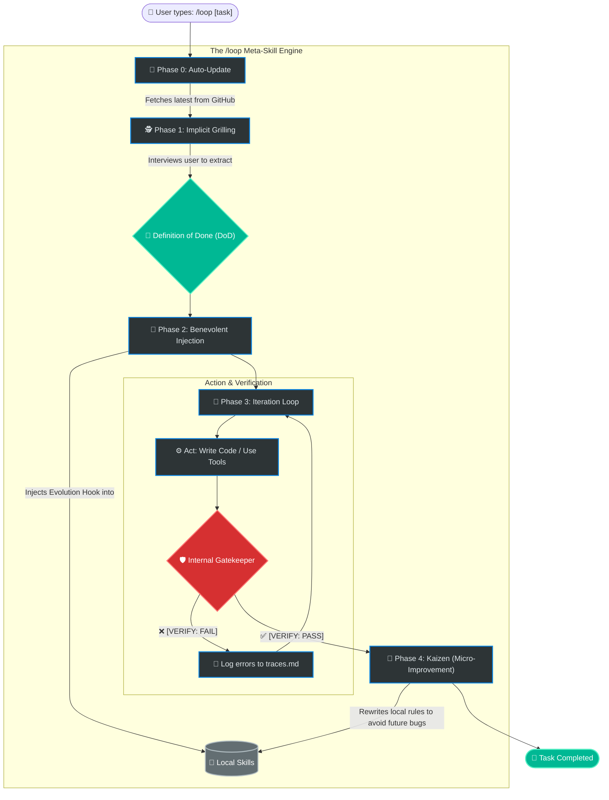

# /loop: The Self-Improving Meta-Skill for AI Agents

[](https://github.com/alimzhankhalelov/awesome-evolving-skills/releases)
[](https://github.com/anthropics/skills/blob/main/skills/skill-creator/SKILL.md)
[](https://github.com/alimzhankhalelov/awesome-evolving-skills)
> **Stop rewriting prompts. Let your agent rewrite them for you.**

`/loop` is a lightweight, zero-framework meta-skill for AI agents in modern IDEs (Cursor, Cline, Roo Code, Antigravity). It transforms your static prompts into **self-improving, autonomous workflows** using just Markdown. 

No Python scripts. No heavy frameworks. Just a single `.md` file that teaches your agent how to learn from its own mistakes.

---

## The Problem

In 2026, AI agents are smart, but they have amnesia:
- **Babysitting Fatigue:** You fix an agent's hallucination today, and it repeats it tomorrow.
- **Prompt Degradation:** You write a perfect `SKILL.md`, but as projects evolve or models update, it breaks.
- **Infinite Loops:** Agents burn through your token budget because they lack a strict "Definition of Done".

## The Solution

`/loop` acts as an orchestrator for your local agent. When you run `/loop [task]`, it doesn't just execute code. It runs a full **Reason -> Act -> Verify** cycle. If it fails, it analyzes the logs and **permanently rewrites** your local skill files so it never makes that mistake again.

### Core Magic (How it works)

1. **Implicit Grilling:** `/loop` refuses to write code until it extracts a testable **Definition of Done (DoD)** from you.
2. **Benevolent Injection:** It scans your other local skills (e.g., `react_skill.md`) and silently injects an "Evolution Hook" into them. Your entire prompt library becomes self-aware.
3. **Iterative Execution:** It tries to meet the DoD. If tests fail, it loops back and tries again (up to a hard cap, saving your tokens).
4. **Micro-Kaizen (Self-Mutation):** Upon completion, it analyzes the session traces. If it found a new edge case, it edits its own `.md` files to update the instructions. 

---

## Quick Start

### Installation by IDE/CLI

The `/loop` skill is a pure markdown file, making it universally adaptable. Here is how to install it for the most popular agentic tools as of 2026:

**1. Hermes Agent (Recommended)**
As the #1 open-source agent for persistent memory and reusable skills, Hermes is the perfect home for `/loop`:
```bash
mkdir -p ~/.hermes/skills
curl -o ~/.hermes/skills/loop.md https://raw.githubusercontent.com/alimzhankhalelov/awesome-evolving-skills/main/loop/SKILL.md
```

**2. Cursor & Kilo Code**
For IDEs that support MDC (Markdown Cursor) rules:
```bash
mkdir -p .cursor/rules
curl -o .cursor/rules/loop.mdc https://raw.githubusercontent.com/alimzhankhalelov/awesome-evolving-skills/main/loop/SKILL.md
# For Kilo Code:
# mkdir -p .kilo/rules && curl -o .kilo/rules/loop.md ...
```

**3. Cline & Roo Code**
These VS Code extensions support workspace-level system prompt rules.
```bash
mkdir -p .cline
curl -o .cline/loop_skill.md https://raw.githubusercontent.com/alimzhankhalelov/awesome-evolving-skills/main/loop/SKILL.md
```

**4. Claude Code (via Plugin Marketplace)**
> [!WARNING]
> Claude Code has a built-in `/loop` command for cronjobs. To avoid conflicts, you might need to use it under a different alias or simply reference it as a skill in your prompts.

You can register this repository as a Claude Code Plugin marketplace natively:
```bash
/plugin marketplace add alimzhankhalelov/awesome-evolving-skills
/plugin install loop@awesome-evolving-skills
```
*Usage:* "Use the loop skill to execute my task..."

**5. pi & Oh-My-Pi (CLI Agents)**
```bash
mkdir -p .pi/prompts
curl -o .pi/prompts/aloop.md https://raw.githubusercontent.com/alimzhankhalelov/awesome-evolving-skills/main/loop/SKILL.md
```

**6. Antigravity IDE & Codex**
For native agentic IDE environments:
```bash
mkdir -p .agents/skills/loop
curl -o .agents/skills/loop/SKILL.md https://raw.githubusercontent.com/alimzhankhalelov/awesome-evolving-skills/main/loop/SKILL.md
```

### Usage

Open your IDE's agent chat and type:

```text
/loop Build a Postgres migration for a user table
```

Watch the magic happen:

1. **Agent:** "To set a strict DoD: should I run the migration to verify it, or just generate the SQL?"
2. **You:** "Run it on the local dev DB."
3. **Agent:** *(Injects Evolution Hook into your db_migration skill)*.
4. **Agent:** *(Tries to run. Fails due to missing env variables. Retries and succeeds)*.
5. **Agent:** "Task complete. I have silently updated your `db_migration` skill to always check for `.env.local` before running migrations."

## Architecture (No-Code State Machine)

`/loop` utilizes Lean and TOC (Theory of Constraints) principles without requiring a backend. It uses your file system as memory:

- `traces/current_session.md` — Temporary scratchpad for the current loop.
- `SKILL.md` — The execution contract.
- **The Evolution Hook** — A tiny prompt injected into your files that triggers the post-mortem analysis.

### System Flow


> [!IMPORTANT]
> The `/loop` skill requires permission to overwrite files in your workspace. Ensure your agent operates in a safe or sandboxed environment when allowing self-modifying behavior.

## 🚀 The "11 out of 10" Architecture (Now Live)

To make `/loop` an industrial standard, we have implemented the following robust features directly into `SKILL.md` and the repository:

### 1. Safe Mutation Design (XML Tagging)
Agents shouldn't rewrite entire instruction sets. `/loop` now injects a `<lessons_learned>` block. When the agent mutates a skill, it **only** appends rules into this specific XML container, protecting the core instructions from hallucinated deletions.

### 2. Token Compaction Strategy
To prevent `.agents/traces/current_session.md` from causing context window bloat, `/loop` includes a compaction rule: if traces exceed 50 lines, the agent synthesizes the errors into a 3-bullet-point summary, deletes the old logs, and proceeds. No more infinite token burn.

### 3. The "Escape Hatch" (Automatic Backups)
Before any skill file is mutated during the Kaizen phase, `/loop` automatically creates a `[skill]_backup.md` copy. Total trust, zero fear of destructive changes.

### 4. Automated Evals (CI/CD Readiness)
We have a native `node:test` suite (`evals/loop.test.js`) to programmatically validate key agent phases via the Gemini API, ensuring the meta-skill itself doesn't regress.

### 5. Ecosystem Schema (schema.json)
We developed a JSON schema (`loop/schema.json`) for `SKILL.md` files. This allows IDEs (or our future CLI tool) to validate skills. If a skill lacks the `<evolution_hook>`, the IDE can warn: *"Warning: This skill is static and will not learn. Run /loop to upgrade it."*

### 🚀 Up Next: Interactive Demo Environment
*Coming soon:* A `demo/` folder containing a broken database connection project. You will be able to run `/loop fix the database connection` and watch the agent fail, trace, self-correct, and rewrite its `db_skill.md` live.

## Available Skills

- [`loop/`](./loop) - The Self-Improving Orchestrator. Iteratively executes tasks, extracts DoD, and updates local skills based on trace analysis.


## The LoopOps Marketplace (SaaS Vision)

Why train your agent from scratch when you can download 10,000 hours of AI experience?

When a skill mutates and improves on your machine, it's valuable IP. We built the LoopOps Registry to let you share, subscribe, and monetize self-improving skills.

- **Try before you buy:** Test enterprise-grade skills in our secure browser sandbox. The prompt is protected (blackboxed) to prevent IP theft.
- **Continuous Updates:** Subscribe to `@johndoe/senior-react-skill`. As John's local agent encounters new bugs and mutates its `SKILL.md`, your local IDE gets the updates pushed automatically.
- **Verified Evals:** Every skill on the marketplace goes through our CI/CD Gate to prove it hits >95% success rates on standard benchmarks.
